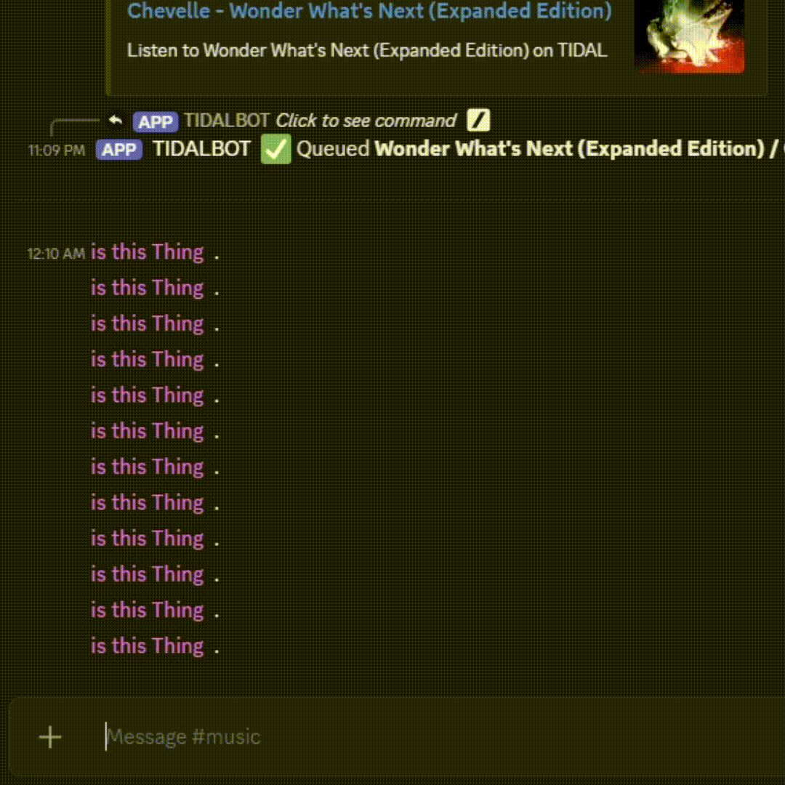
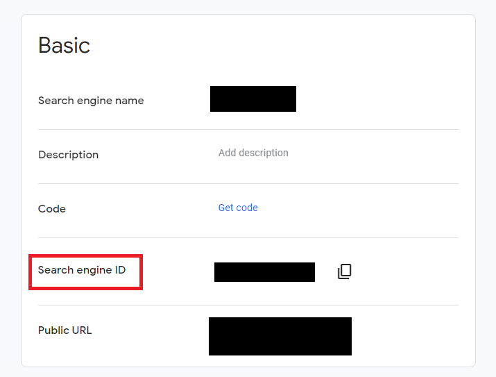
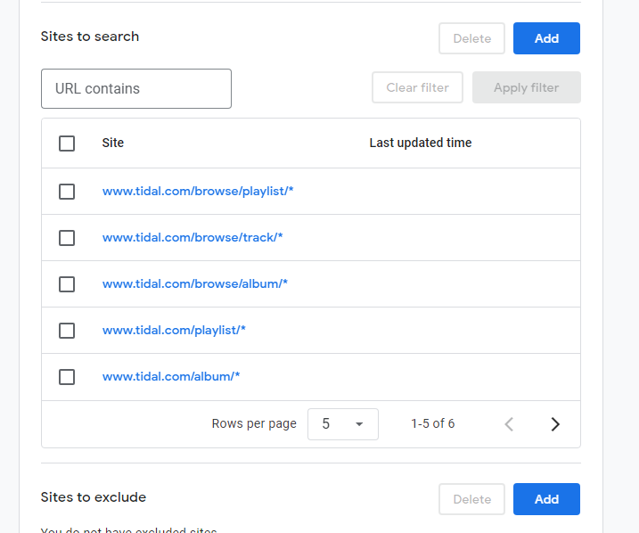
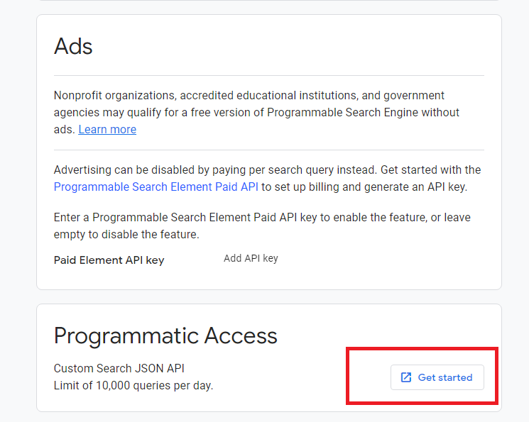
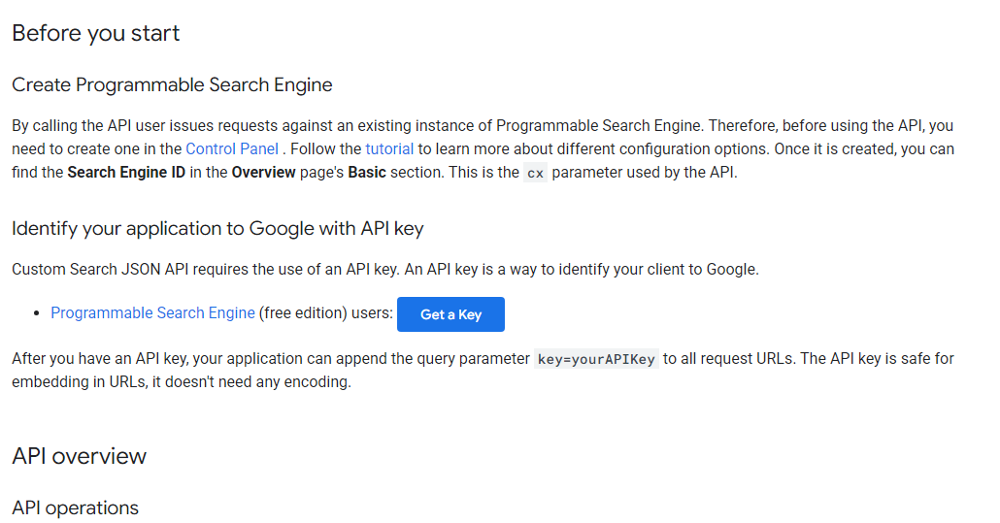

# 🎧 Discord Tidal Downloader Bot

A modern Discord bot that lets users *search for and download Tidal tracks, albums, and playlists* remotely **to the owner's database**.  
Built with **Node.js**, **Discord.js v15**, and Google Search API integration.

---

## Demo

<p align="center">
  
</p>
<p align="center"> /tidalsearch in action </p>

---

## 🚀 Features

- `/tidal <url>` — Download directly from a Tidal link  
- `/tidalsearch <query>` — Search for tracks/albums/playlists via Google  
- Real-time progress updates while downloading  
- Queue system (one download at a time)  
- Embedded, paginated search results with thumbnails and “Download” button  
- Built-in Google Search filtering (Tidal-only domains)  

---

## 🧩 Prerequisites
- **[Install of tidal-dl-ng](https://github.com/exislow/tidal-dl-ng)**
- **FFMPEG**
- **Node.js v18+**
- **npm**
- A registered **Discord bot token**
- [Register a Custom Search Engine](https://programmablesearchengine.google.com/controlpanel/create) and client ID
- [A **Google API key** for Custom Search Engine](https://developers.google.com/custom-search/v1/introduction)

---

## ⚙️ Install:
### 1️. [Install TIDAL-DL-NG](https://github.com/exislow/tidal-dl-ng) login with your credentials, and configure as needed (ffmpeg). Must have an active subscription to [Tidal](https://tidal.com/).
**Note the path of tidal-dl-ng, you'll need it for the .env. Command on Ubuntu:*
```bash
which tidal-dl-ng
```

### 2️. Clone the repository

```bash
git clone https://github.com/YOUR_USERNAME/discord-tidal-bot.git
cd discord-tidal-bot
```
### 3. Install dependencies

```bash
npm install
```

### 4. Create .env

Create a file named .env (sudo nano .env) in the project root directory and fill in your credentials:

```bash

DISCORD_TOKEN=your_discord_bot_token_here
CLIENT_ID=your_discord_bot_client_id
GUILD_ID=your_test_server_id
GOOGLE_CSE_ID=your_google_cse_id
GOOGLE_API_KEY=your_google_api_key
TIDAL_DL_NG_PROCESS_PATH=path_to_process
```

### 5. Deploy and start program:

```bash
node deploy-commands.js

node index.js
```
## GOOGLE CSE AND API









